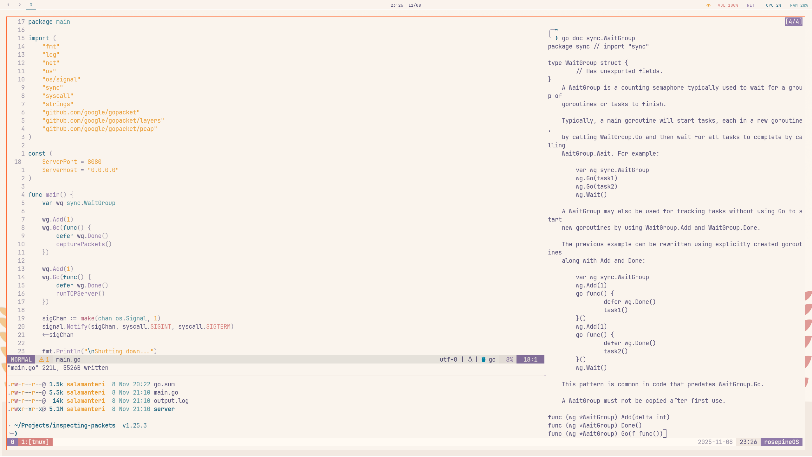

# Dotfiles

This repository holds configuration files for various command line utilities I use on all of my UNIX-based systems.

# rosepineOS

## Workflow
I'm trying to improve my tmux + nvim setup enough that I could use it day to day.

The most important plugins to me are Telescope, Language Servers and Autocomplete. Everything else is just for show...
